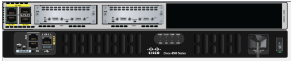
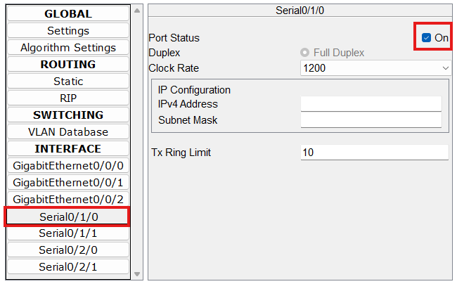

# ipv6.network

IPv6 Networking

## Module für Serielle Verbindung hinzufügen

- Router manuell ausschalten über die Phyiscal Device View
- 2 NIM-2T Module für die seriellen Interfaces installieren & neu configurieren lassen

## Interfaces anschalten

- benutzte Serial Interfaces oben rechts anschalten

## Interface für IPv6 konfigurieren

- im Router selber erstmal in das Config Terminal reingehen

        Router#configure terminal

- im Config Terminal auf das Interface was bearbeitet werden soll navigieren

        Router (config)#interface Serial0/1/0

- in der Interface Config IPv6 enablen und shutdown negieren

        Router (config-if)#ipv6 enable
        Router (config-if)#no shutdown

- in der Interface Config anschließend die IPv6 Addresse hinterlegen und die Netzgröße einrichten

        Router (config-if) ipv6 address FFFF:FF:FF::/64 eui-64
