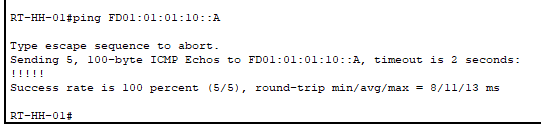

# ipv6.network

IPv6 Networking

## Module für Serielle Verbindung hinzufügen

- Router manuell ausschalten über die Phyiscal Device View
- 2 NIM-2T Module für die seriellen Interfaces installieren & neu configurieren lassen

## Interface für IPv6 konfigurieren

- im Router selber erstmal in das Config Terminal reingehen

        configure terminal

- im Router Config Terminal IPv6 Global Aktivieren & Domainenauflösung ausschalten
        
        ipv6 unicast-routing 
        no ip domain-lookup

- im Config Terminal auf das Interface was bearbeitet werden soll navigieren

        interface Serial0/1/0

- in der Interface Config Beschreibung der Schnittstelle & IPv6 setzen (Netzgröße dabei mit angeben) und shutdown negieren

        ipv6 address FD01:01:01:30::2/64
        no shutdown

## Verbindung zwischen Routern testen

- in der CLI mit dem Befehl "ping" und der entsprechenden IPv6 arbeiten (OHNE Netzgröße)

        ping FD01:01:01:10::A

